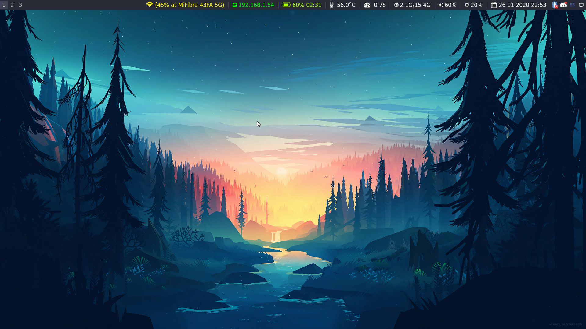
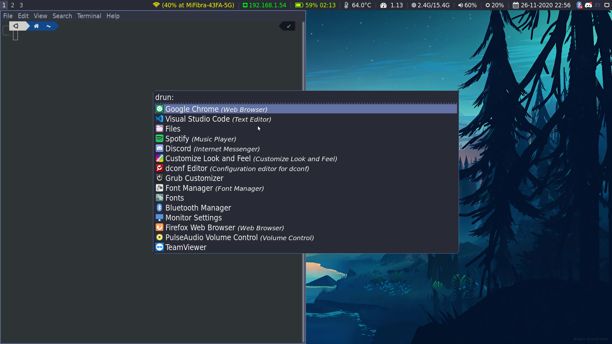

# My Dotfiles

Custom config for .zshrc, .vimrc, init.vim (neovim), i3wmn, i3status, i3block+custom, picom and dunst scripts.

## I3 Gallery

[i3blocks Scripts](https://github.com/vivien/i3blocks-contrib)
[GTK Theme](https://github.com/horst3180/arc-theme)
[GTK Icons](https://github.com/horst3180/arc-icon-theme)
[GRUB Theme](https://github.com/vinceliuice/grub2-themes)
